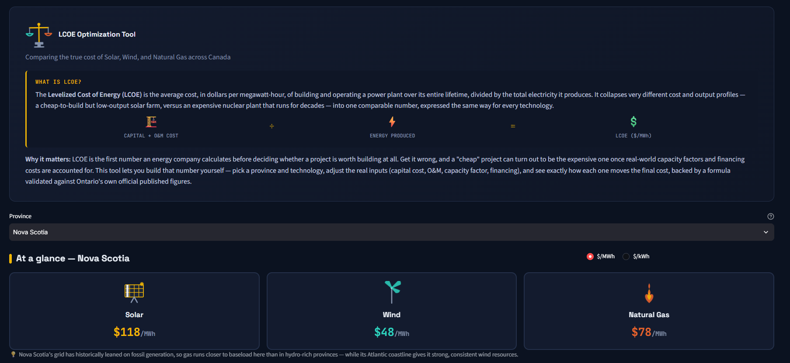

# ⚖️ LCOE Optimization Tool — Canada

An interactive tool for calculating and comparing the Levelized Cost of Energy (LCOE) for Solar, Wind,
and Natural Gas across all 10 Canadian provinces. Built as part of a personal portfolio demonstrating
applied energy economics and financial modeling for renewable energy infrastructure.

**[Live Dashboard →](#)** *(https://lcoe-optimization-tool.streamlit.app/)*

## Screenshot


---

## What is LCOE, and why does it matter?

The **Levelized Cost of Energy (LCOE)** is the average cost, in dollars per megawatt-hour, of building
and operating a power plant over its entire lifetime, divided by the total electricity it produces. It
collapses very different cost and output profiles — a cheap-to-build but low-output solar farm, versus
an expensive gas plant that runs almost constantly — into one comparable number, expressed the same way
for every technology.

**LCOE is the first number an energy company calculates before deciding whether a project is worth
building at all.** Get it wrong, and a "cheap" project can turn out to be the expensive one once
real-world capacity factors and financing costs are accounted for. This tool lets you build that number
yourself — pick a province and technology, adjust the real inputs, and see exactly how each one moves
the final cost.

---

## What this tool does

- Select any of Canada's **10 provinces**
- Select a technology: **Solar**, **Wind**, or **Natural Gas**
- Adjust real inputs — Capital Expenditure, Fixed O&M, Capacity Factor, Discount Rate, Project Life, and
  (for gas) Fuel Cost — and see the resulting LCOE calculated live
- View a **sensitivity tornado chart** showing which input matters most for each technology/province
- Toggle between **$/MWh** and **$/kWh** display
- Read a **dynamic "why this number?" insight** explaining each result in plain English

---

## Data & methodology

### The formula

Following the standard NREL/IESO methodology:

**LCOE = (CapEx × CRF + Fixed O&M) / (AEP_net / 1000) + Variable O&M + Fuel Cost**

Where CRF (Capital Recovery Factor) is derived from a real discount rate and project life:

**CRF = r(1+r)ⁿ / ((1+r)ⁿ − 1)**

### Formula validation

The formula was validated against **IESO's (Ontario's grid operator) March 2024 published LCOE
figures** for Wind, Solar, and Natural Gas. Initial testing with a single shared financing rate came
within 1–5% — investigation revealed IESO uses **technology-specific fixed charge rates** (Wind 6.40%,
Solar 6.11%, Gas 6.53%, not one shared rate). Refitting with these brought results to within **0.05
$/MWh** of IESO's published numbers.

To make discount rate and project life independently adjustable (rather than baked into one fixed
rate), the formula was extended to derive financing cost via CRF. Reverse-solving for the discount rate
each technology implied — tested at both 20-year and 25-year project life — found that **25 years**
produced discount rates (3.56–4.19%) landing almost exactly on **NREL's independently-published real
WACC range (3.66–4.01%)** for reference wind projects, external validation that 25 years is the correct
assumption.

### Data sources

| Data | Source | Coverage |
|---|---|---|
| CapEx, O&M, Capacity Factor, LCOE | [IESO 2024 Annual Planning Outlook — Resource Costs and Trends](https://www.ieso.ca/) | Ontario (officially sourced) |
| CapEx | [AESO 2024 Long-Term Outlook](https://www.aeso.ca/) | Alberta (officially sourced) |
| Capacity factor (8 remaining provinces) | Reasoned estimates from documented Canadian wind/solar resource geography and provincial generation mix | BC, SK, MB, QC, NS, NB, PE, NL |

**Research finding worth stating plainly**: IESO and AESO appear to be the only two Canadian grid
operators publishing standardized, technology-level $/kW cost tables. BC Hydro and SaskPower were
checked directly — both publish project-level totals and qualitative resource assessments, but not
comparable granular tables. This is a genuine characteristic of the Canadian data landscape.

---

## Key findings

**Wind is the cheapest technology in every single province** (10 of 10, no exceptions), ranging from
$35.09/MWh (Alberta) to $65.13/MWh (BC).

**Alberta's wind is the cheapest option in the entire dataset** — not because of an unusually strong wind
resource (its 37% capacity factor is mid-pack), but because AESO's real, sourced capital cost
($1,105/kW) is 39% lower than the Ontario-derived default used elsewhere ($1,824/kW) — concrete evidence
of Alberta's mature, merchant-driven renewable market delivering genuinely lower build costs.

**Natural gas shows a 3x spread** — $71.14/MWh (Alberta) to $214.14/MWh (Quebec) — driven entirely by how
each grid actually dispatches gas, not the hardware cost. Hydro-dominant provinces (Quebec, BC,
Manitoba) barely use gas (10–20% capacity factor), making it their most expensive option; gas-reliant
provinces (Alberta, Saskatchewan) run it closer to baseload (50–55% CF), keeping it competitive. **LCOE
is a property of a technology as deployed in a specific grid, not the hardware alone.**

**Solar tracks provincial sunshine almost exactly** — Saskatchewan (Canada's sunniest, 25% CF) is
cheapest at $66.19/MWh; Newfoundland (Canada's cloudiest, 12% CF) is most expensive at $137.90/MWh.

Full sensitivity analysis (tornado charts, per-parameter swing data) available in
`notebooks/02_sensitivity_analysis.ipynb`.

---

## Project structure

lcoe-optimization-tool/
├── data/
│   ├── lcoe_defaults.csv          # 10 provinces x 3 technologies, validated defaults
│   ├── sensitivity_summary.csv
│   └── sensitivity_full.csv
├── notebooks/
│   ├── 01_lcoe_fundamentals.ipynb  # Formula derivation + IESO validation
│   └── 02_sensitivity_analysis.ipynb  # CRF extension, tornado charts, 10-province expansion
├── src/
│   └── lcoe.py                     # Reusable calculation, sensitivity, and plotting functions
├── app.py                          # Streamlit dashboard
├── requirements.txt
└── README.md

## Running locally

```bash
git clone https://github.com/tmugomba/lcoe-optimization-tool.git
cd lcoe-optimization-tool
python -m venv venv
venv\Scripts\activate        # Windows; use `source venv/bin/activate` on Mac/Linux
pip install -r requirements.txt
streamlit run app.py
```

## Limitations

- Nova Scotia, BC, Saskatchewan, Manitoba, Quebec, New Brunswick, PEI, and Newfoundland's capacity
  factors are reasoned estimates, not directly sourced — clearly tagged in-app and in the data
- CapEx, Fixed O&M, and discount rate are treated as consistent across provinces (equipment/financing
  markets are largely national) except Alberta, which uses AESO's real, lower figures
- Sensitivity analysis uses a flat ±5 percentage point capacity factor range across all technologies,
  which disproportionately affects low-capacity-factor cases (e.g. Quebec's 10% gas CF) — documented in
  Notebook 2 as a known limitation, not smoothed over

## Tools

Python, pandas, NumPy, Plotly, Streamlit, Jupyter

## Data license

IESO and AESO data used under their respective public reporting terms. This tool is for educational and
portfolio purposes; **do not use for actual investment decisions** without consulting current, verified
figures from the relevant grid operator or a qualified financial advisor.

---

## About the author

**Tendekai Mugomba** — Electrical engineering student passionate about renewable energy, building
data science skills at the intersection of energy systems and machine learning. Currently gaining
hands-on experience in solar PV analytics, M&V, and energy modeling, and building this portfolio to
apply that growing skill set to broader ML-driven energy problems.

[LinkedIn](https://www.linkedin.com/in/tendekai-mugomba) · [GitHub](https://github.com/tmugomba)